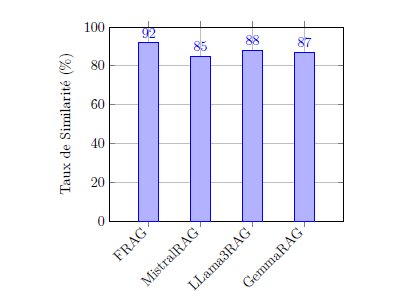

# FRAG: Fine-tuned RAG Model with Ollama and Langchain

## Introduction

FRAG (Fine-tuned Retrieval-Augmented Generation) est un modèle de génération de texte qui combine les techniques de recherche de vecteurs et de génération de texte fine-tunées. Ce projet détaille le processus de création de FRAG, en passant par les étapes de fine-tuning, la justification du choix du modèle fine-tuné, et la conception avec Ollama et Langchain.

## Étapes de Création

### 1. Fine-tuning du Modèle Mistral

Pour optimiser les performances de FRAG, nous avons choisi de fine-tuner le modèle Mistral. Après avoir comparé plusieurs modèles, Mistral a montré une précision supérieure, particulièrement après le fine-tuning, ce qui en fait un choix idéal pour notre approche.

### 2. Justification du Choix du Modèle

Le modèle Mistral a été sélectionné en raison de sa précision plus élevée par rapport aux autres modèles testés. Après le fine-tuning, Mistral a surpassé les autres modèles en termes de performance de génération de texte, justifiant ainsi son intégration dans l'approche FRAG.

### 3. Conception de FRAG avec Ollama et Langchain

La conception de FRAG a impliqué l'intégration du modèle Mistral fine-tuné avec Ollama et Langchain pour la génération de texte. Les étapes clés de cette intégration incluent :

- **Création de Vecteurs** : Utilisation de `SentenceTransformer` pour générer des embeddings de texte.
- **Recherche dans la Base de Données** : Utilisation de requêtes vectorielles pour récupérer les données les plus pertinentes.
- **Génération de Prompts** : Création de prompts spécifiques basés sur les résultats de la base de données.
- **Génération de Texte** : Utilisation de modèles de Langchain et Ollama pour générer des réponses basées sur les prompts créés.

### 4. Résultats Finaux

Les performances de FRAG ont été évaluées et comparées à plusieurs autres modèles RAG :

- **FRAG** : 92%
- **MistralRAG** : 85%
- **LLama3RAG** : 88%
- **GemmaRAG** : 87%

Ces résultats démontrent la supériorité de FRAG en termes de précision, validant notre approche et le choix du modèle fine-tuné.

## Conclusion

Le projet FRAG illustre l'efficacité de la combinaison de fine-tuning et de techniques avancées de recherche et de génération de texte. Grâce à une conception soignée et à l'intégration de modèles optimisés, FRAG offre une performance supérieure dans la génération de texte augmentée par la recherche.

## Illustration des Résultats

Cette image illustre les résultats finaux obtenus par FRAG et les modèles comparatifs, mettant en évidence la performance supérieure de FRAG.
